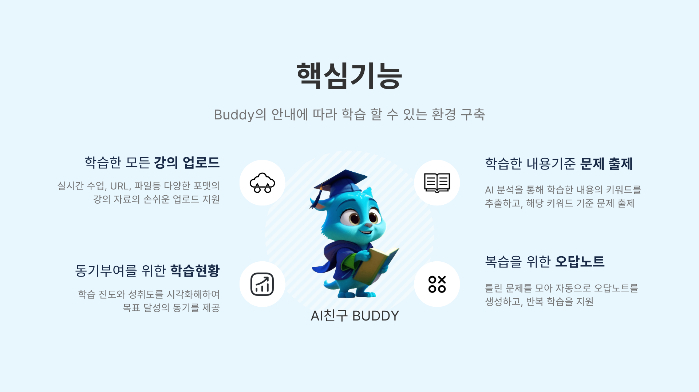
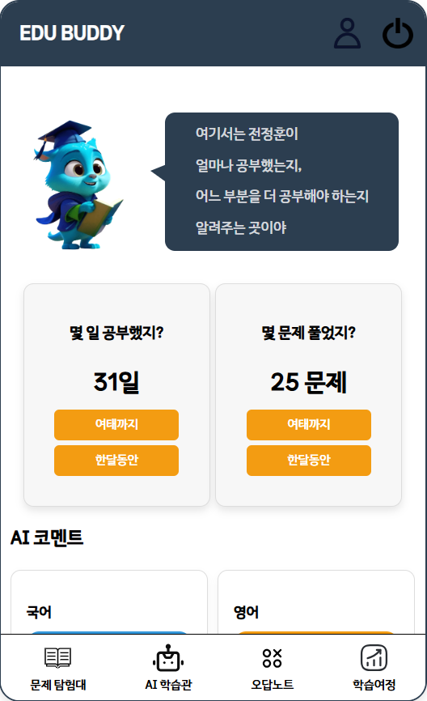
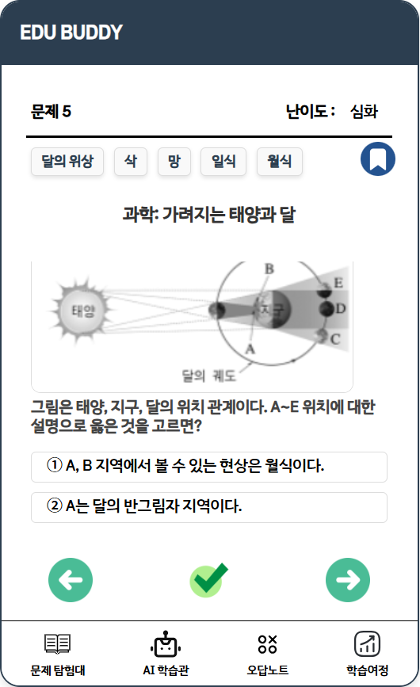
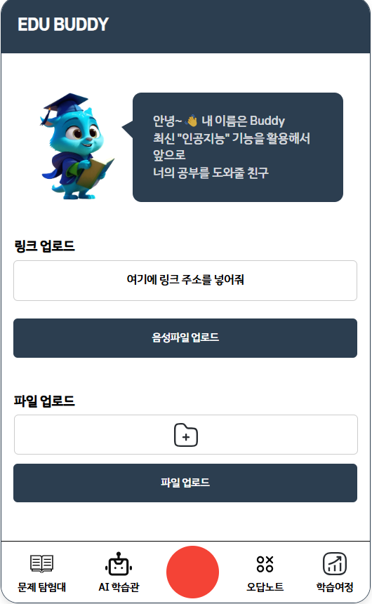
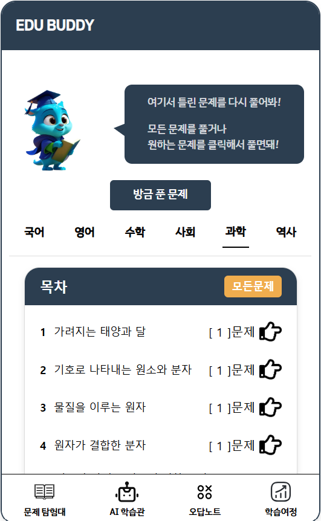
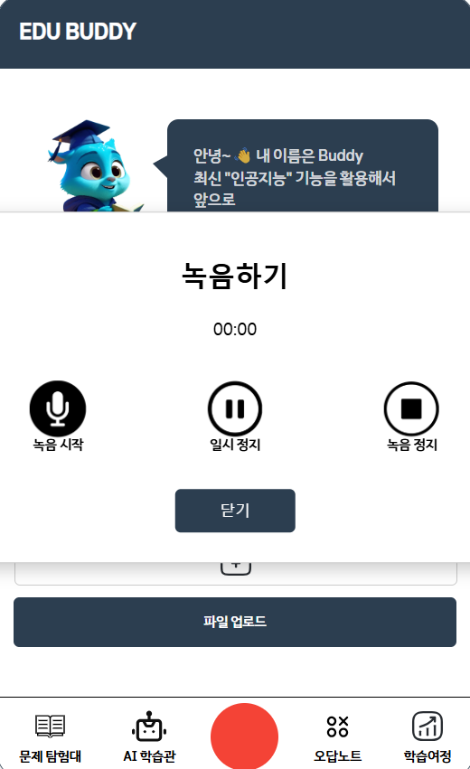
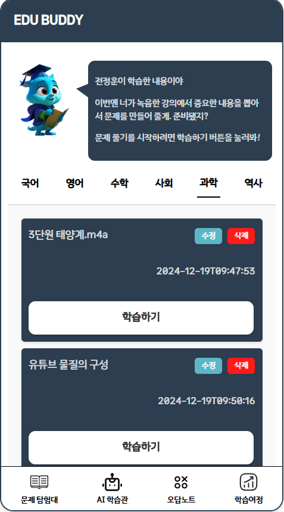
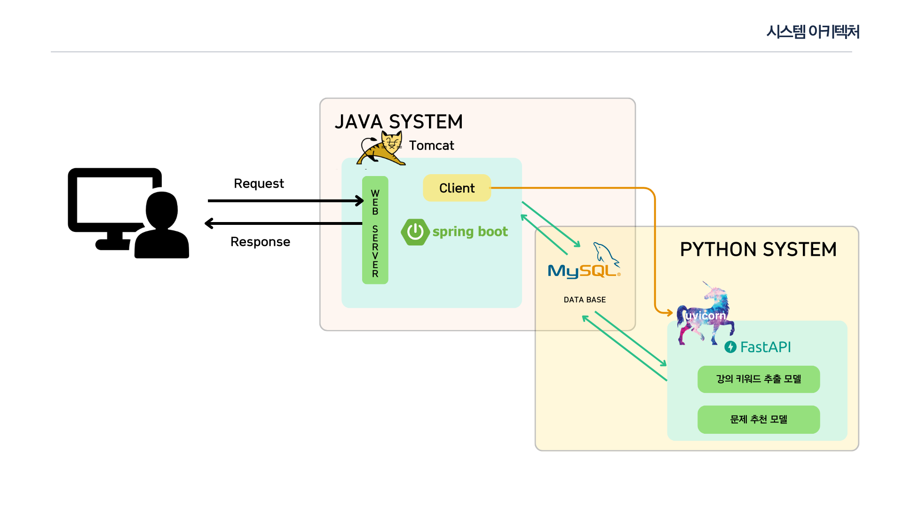

# 수업내용 기반 문제 출제 서비스 : EduBuddy

EduBuddy는 중위권 학생을 위한 맞춤형 학습 플랫폼으로, 학습 방향 설정부터 맞춤 문제 출제까지 학습 전 과정을 지원합니다.
이 프로젝트는 학습 효율성을 극대화하고 학생들에게 개인화된 학습 경험을 제공합니다.

 

---

## 🗂️ **목차**

1. [프로젝트 개요](#프로젝트-개요)
2. [기술 스택 및 개발 환경](#기술-스택-및-개발-환경)
3. [주요 기능](#주요-기능)
4. [시스템 아키텍처](#시스템-아키텍처)

---

## 💡프로젝트 개요

**문제 인식**  
- 학습 방향 설정에 어려움을 겪는 중위권 학생들을 위한 맞춤형 학습 플랫폼 부족.  

**기회**  
- 생성형 AI 기술로 편리하고 개인화된 학습 환경 제공 가능.  

**타겟 이용자**  
- 중위권 중학생  

**서비스 목적**  
- 학습 효율성 강화, 개인 맞춤형 문제 제공, 학습 동기 부여.  

---

## 🎯 기술 스택 및 개발 환경

### 언어
    

### 프레임워크 및 라이브러리
 

### 서버 및 배포 환경
 

### 데이터베이스

### 개발 도구
  

### 협업 도구
  

## 주요 기능

1. **학습한 내용 기준 문제 출제**
    - AI 분석을 통해 학습한 강의의 키워드를 추출하여 맞춤형 문제를 생성.
    - 학생의 수준과 학습 내용을 고려한 개인화 문제 제공.
2. **복습을 위한 오답노트**
    - 틀린 문제를 자동으로 정리하여 오답노트를 생성.
    - 과목별, 단원별로 분류하여 체계적으로 복습 가능.
3. **강의 자료 업로드**
    - **영상 및 음성 파일**을 업로드하고, AI가 강의 내용을 분석.
    - 업로드된 자료에서 핵심 키워드를 추출하여 학습 방향 제공.
4. **동기부여를 위한 학습 현황 제공**
    - 학습 일수와 문제 풀이 수를 숫자로 직관적으로 시각화.
    - 오답 키워드를 중심으로 약점을 분석하고 개선 방향 제시.

## 주요 기능 화면

| 학습 현황 대시보드                | 문제 출제 화면                 | 홈 화면                     |
|----------------------------------|-------------------------------|-----------------------------|
|  |  |  |

| 오답노트 화면                   | 강의 녹음 화면                | 강의 키워드 추출              |
|----------------------------------|-------------------------------|-----------------------------|
|  |  |  |

---

## 🎯 시스템 아키텍처

